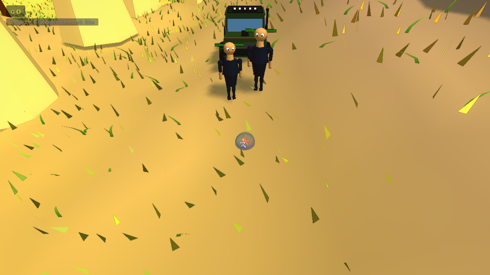
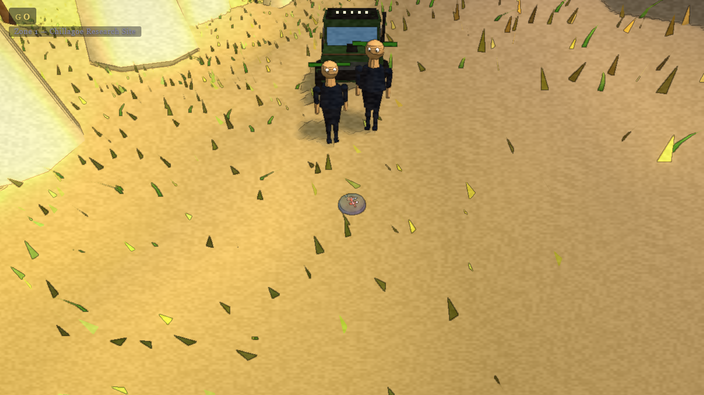
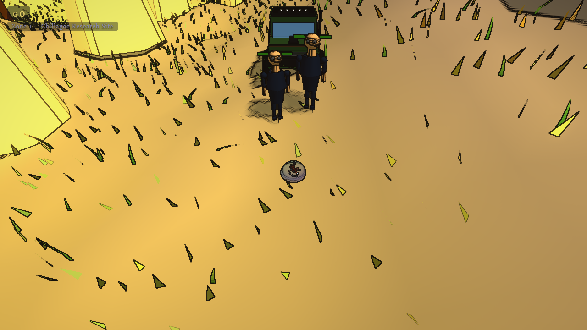
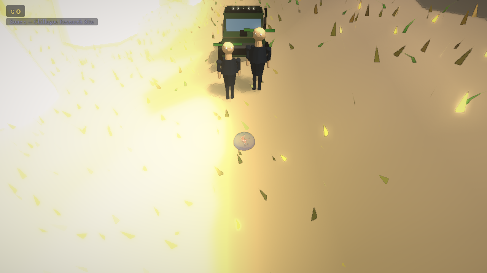
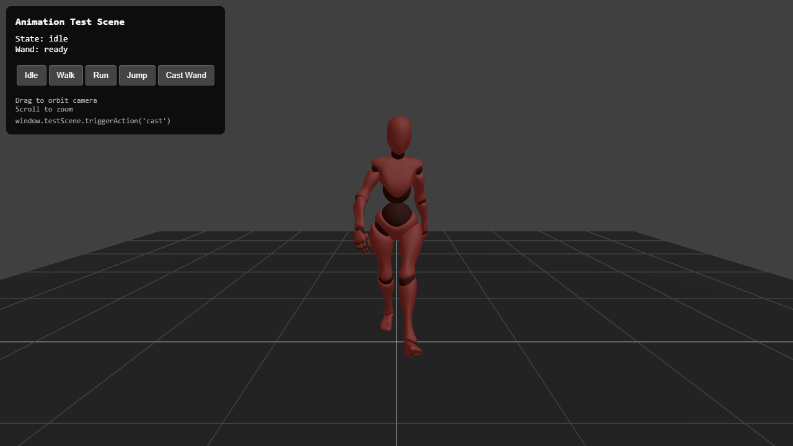

# Chromatic Resonance 3D

> A third-person 3D action RPG experiment. Particle-life blob characters, colour as a resource, NPR rendering, an open world, vehicles, and a self-driving multi-agent QA loop. Lots of systems, polish never landed.


[**Live demo →**](https://danfking.github.io/chromatic-resonance-3d/)



*The blob player, a jeep, and a couple of NPCs in the Chillagoe Research Site. Rendered through the Low Poly style preset.*

### Same scene, four style presets

The renderer ships a Style Lab that swaps post-processing chains at runtime (1-4 in debug mode, F3). Here is the same frame above, rendered through the four current presets.

| | |
|---|---|
|  |  |
|  |  |

*Top: Watercolour (default), Low Poly. Bottom: Borderlands, BotW. The presence of multiple "candidate" styles, and the absence of a chosen one, is a big part of what this experiment showed; see below.*

## About this project

This game, like most of the others in my side-projects work, is an experiment in fully agentic generation. Where it diverges from the others is scope. The agent suite was given a wide remit and produced a system-rich game: a particle-life blob player, a colour-extraction wand with combos, a three-layer item system that mutates the player's particle composition, an open world with vehicles, NPCs, procedural music, multiple zone themes, an isolated test harness, and a multi-agent QA loop that runs review-fix-test cycles autonomously. What it didn't produce was a unified visual style. The art direction went through several iterations (watercolour, then Sable-style flat colour with bold outlines) and never reached a state I was happy with.

Read this README in two layers. There's the game (which is more of a sandbox than a game) and the meta question (what happens when you give an agent suite enough rope to build a *lot* without enforcing a coherent visual target). The second is the harder problem and the one this project mostly answers.

## What it is

A third-person 3D action RPG built in Three.js, set in "The Bloom", a fictional Far North Queensland setting. You play as a blob: a particle-life creature whose body is composed of elemental, vitality, essence, and armour particles that swarm around a centre of mass and deform on movement. You explore an open-world zone, fight wave-based combat, and collect items that change how your particles behave. There's also a jeep with full physics for traversal.

The colour system is the defining mechanic. You start with one colour (Ivory) which provides primary mana with passive regen. The other five colours don't regenerate; you collect them from enemies. Each colour adds a different effect when used through your wand (burn, slow, lifesteal, pierce, homing), and ten colour combinations have unique blended effects.

## Why I built it (the scope question)

I wanted to know how far a multi-agent setup could carry a single project before the seams started showing. Most agentic-coding demos are small: a function, a feature, a test. This one was a deliberate test of breadth. Could the agent suite extend itself across a particle physics system, a renderer, a controller, a combat loop, an item system with three progression layers, vehicles, NPCs, and procedural music, while keeping the parts coherent? The answer was: yes for individual systems, no for the visual identity that would tie them together.

## How to run it

```bash
git clone https://github.com/danfking/chromatic-resonance-3d.git
cd chromatic-resonance-3d
npm install
npm run dev
```

Then open `http://localhost:8082`.

For a built version: `npm run build` and `npm run preview`.

To run the full game with all animations, you'll need to download a few CC0 humanoid models. See [`assets/models/README.md`](assets/models/README.md) for the recommended sources and where to place the files. Without them you'll still be able to walk around and shoot, but enemies and the player will use placeholder geometry.

## Controls

- **WASD** — move (momentum-based)
- **Mouse** — look
- **Space** — jump (hold for higher)
- **Shift** — slide while moving (0.8s cooldown)
- **Left click** — fire wand
- **Tab** — open spell management menu (pauses)
- **I** — open equipment panel (pauses)
- **F3** — debug mode (exposes `window.game`, switches between style presets via 1-5)
- **ESC** — release mouse / pause

## Tech stack

- Three.js for 3D rendering
- Vite for dev server and build
- Vanilla ES modules
- Custom NPR post-processing chain (Sable outline, Kuwahara, edge darkening, bloom, Reinhard colour transfer, paper texture)
- Particle Life simulation for blob characters
- Procedural audio and procedural music (Web Audio API)
- Playwright for visual regression and animation integrity tests
- A multi-agent QA system (Reviewer-Fixer-Verifier loop) that lived alongside the codebase and ran autonomously when given a target — not shipped with the public repo, but documented in [ARCHITECTURE.md](ARCHITECTURE.md)

## What this experiment showed about agentic generation

This is the section worth reading even if you don't care about the game.

- **System breadth scales further than visual coherence.** The agent suite shipped a remarkable amount of *systems*: combat, items, particles, vehicles, NPCs, audio, music. Each system internally hangs together. What it could not deliver was a single coherent visual identity across all of them. Style is a global property of a project; system implementation is local. The agent loop was good at local, weak at global.
- **Multi-agent QA loops do work, within bounds.** I built a Reviewer-Fixer-Verifier loop that ran autonomously, with hard caps on iterations and escalation rules. It successfully caught and fixed several classes of issue (animation bone separation, FPS regression, broken state transitions). It could not catch issues that needed taste. Aesthetic regressions slid past it.
- **Style presets in code are a hedge, not a solution.** I built a Style Lab module that swaps between five visual presets at runtime (Watercolour, Low Poly, Borderlands, BotW, Sable). Useful for evaluation, but having five "candidate styles" is not the same as having one *chosen* style. The decision-making part remained mine, and it's the part I never made.
- **Scope creep is the agent's failure mode.** Without strong opinion-shaping inputs, an agent will keep adding systems. Each system is a small win. Together they make a project no human can finish polishing alone. If I came back to this, I'd start by *removing* features, not adding them.
- **Knowing when the experiment has answered itself.** The big finding from this project was the breadth/coherence asymmetry above. That answered the question I built it to answer. Pushing through to a polished release would have been a different experiment about visual direction-setting, with a different agent loop, and I didn't want to confuse the two.



*The isolated test scene the agent QA loop used for animation verification. The main game produced too much visual noise (NPR shaders, particle "grass", enemies, UI) for screenshot-based regression testing to be reliable, so the loop got its own clean room. The character mesh here is a leftover from a humanoid-player iteration that the project moved away from.*

## Status and what's next

Rough proof of concept. The systems work end-to-end. Combat, item drops, the colour wand, vehicles, NPCs, procedural music, the open-world terrain and chunk system are all live. The visual style is unsettled (Sable PoC verdict was "iterate", and I never iterated). Performance has plenty of headroom. The lived-in art polish that would make the project feel like a single thing is what's missing.

If I came back: a deliberate art direction pass with a tighter agent loop tuned for aesthetic critique, then asset replacement and renderer tuning to match. Followed by a scope cut. Probably half the systems would go.

## Architecture

See [ARCHITECTURE.md](ARCHITECTURE.md) for the render pipeline, character controller, colour and combat systems, item layers, world architecture (including the two-terrain-systems gotcha), the multi-agent QA loop, and testing.

## A note on history

This repository was extracted from a private monorepo where I work on
many side projects together. The single initial commit reflects the
migration, not the development cadence; the work itself unfolded across
many sessions.

## License

MIT. See [LICENSE](LICENSE).
